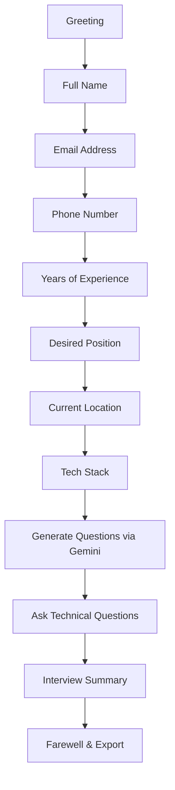

# 🚀 TalentScout Hiring Assistant

An **AI-powered recruitment chatbot** built with **Streamlit** and **Google Gemini**, designed for TalentScout — a fictional technology-focused staffing agency. The assistant conducts structured candidate interviews with real-time technical question generation.

---

## ✨ Features

| Feature | Description |
|---------|-------------|
| 🤖 **AI-Powered Interviews** | Uses Google Gemini to generate tailored technical questions |
| 📋 **Step-by-Step Collection** | Guided data collection with input validation |
| 🛡️ **Input Validation** | Regex-based email, phone, and experience validation |
| 🎨 **Premium UI** | Dark/light mode, gradient accents, animated chat bubbles |
| 📊 **Live Progress Tracking** | Sidebar progress bar and step indicators |
| 🌐 **Multi-Language Support** | English, Spanish, French, Hindi, German |
| 📥 **Data Export** | One-click JSON export of candidate profiles |
| 💬 **Sentiment Detection** | Basic tone analysis for conversational awareness |
| 🔄 **Session Management** | Reset, resume, and track interview state |
| ☁️ **Cloud Ready** | Deploy directly to Streamlit Cloud |

---

## 🏗️ Architecture

```
talentscout/
├── app.py                  # Streamlit entry point
├── requirements.txt        # Python dependencies
├── .env.example            # Environment variable template
├── README.md               # This file
├── src/
│   ├── __init__.py         # Package init
│   ├── chatbot.py          # Core conversation engine & state machine
│   ├── prompts.py          # All LLM prompt templates
│   ├── validators.py       # Input validation & sentiment detection
│   ├── storage.py          # JSON-based persistence layer
│   ├── ui.py               # Streamlit UI components & CSS
│   └── utils.py            # Utility helpers
└── data/
    └── candidates.json     # Persisted candidate records
```

### Design Principles

- **Modular Architecture** — Each concern (LLM, validation, storage, UI) lives in its own module
- **Prompt Engineering** — All prompts are centralised in `prompts.py` for easy iteration
- **Graceful Degradation** — Fallback questions generated if Gemini API fails
- **Session Isolation** — Streamlit `session_state` ensures multi-user safety

---

## 🚀 Quick Start

### Prerequisites

- Python 3.9+
- A free [Google AI Studio API key](https://aistudio.google.com/app/apikey)

### 1. Clone the Repository

```bash
git clone https://github.com/yourusername/talentscout.git
cd talentscout
```

### 2. Create Virtual Environment

```bash
python -m venv venv
# Windows
venv\Scripts\activate
# macOS/Linux
source venv/bin/activate
```

### 3. Install Dependencies

```bash
pip install -r requirements.txt
```

### 4. Configure Environment

```bash
cp .env.example .env
```

Edit `.env` and add your Gemini API key:

```
GEMINI_API_KEY=your_actual_api_key_here
```

### 5. Run the Application

```bash
streamlit run app.py
```

The app will open at `http://localhost:8501`.

---

## 🔑 Gemini API Setup

1. Visit [Google AI Studio](https://aistudio.google.com/app/apikey)
2. Sign in with your Google account
3. Click **"Create API Key"**
4. Copy the key and paste it into your `.env` file

> **Note:** The free tier provides generous rate limits suitable for development and demos.

---

## 💬 Chat Flow



---

## 🎨 Prompt Engineering

All prompts are managed in `src/prompts.py`:

| Prompt | Purpose |
|--------|---------|
| `SYSTEM_PROMPT` | Sets the AI's personality and behavioural rules |
| `greeting_prompt()` | Opening welcome message |
| `next_question(step)` | Returns the data collection question for each step |
| `tech_question_prompt()` | Generates tailored interview questions via Gemini |
| `evaluate_answer_prompt()` | Evaluates candidate answers (extensible) |
| `fallback_prompt()` | Handles unrecognised inputs gracefully |
| `farewell_prompt()` | Professional closing message |

### Example: Tech Question Generation

```python
tech_question_prompt(["Python", "FastAPI", "AWS"], experience_years=4)
```

This generates a prompt asking Gemini to produce 3 practical interview questions per technology, calibrated to a mid-level engineer.

---

## ☁️ Deployment (Streamlit Cloud)

1. Push your code to GitHub
2. Go to [share.streamlit.io](https://share.streamlit.io)
3. Connect your repository
4. Set **Main file path** to `app.py`
5. Add `GEMINI_API_KEY` in **Secrets Management**:
   ```toml
   GEMINI_API_KEY = "your_api_key_here"
   ```
6. Click **Deploy**

---

## 📸 Screenshots

> _Screenshots will be added after deployment._

| View | Description |
|------|-------------|
| Chat Interface | Main conversation view with gradient bubbles |
| Sidebar | Progress tracking, export, and theme controls |
| Tech Questions | AI-generated questions with technology badges |
| Summary | Final interview summary table |

---

## 🧪 Testing

Run validators manually:

```python
from src.validators import validate_email, validate_phone

print(validate_email("jane@example.com"))   # (True, 'jane@example.com')
print(validate_phone("+1234567890"))         # (True, '+1234567890')
```

---

## 🔒 Privacy & Security

- No sensitive data (SSN, passwords) is ever requested
- All data is stored locally in `data/candidates.json`
- API keys are loaded from environment variables, never hardcoded
- Session data is isolated per browser session

---

## 📄 License

This project is open-source and available under the [MIT License](LICENSE).

---

## 🙏 Acknowledgements

- [Streamlit](https://streamlit.io/) — Beautiful data apps framework
- [Google Gemini](https://ai.google.dev/) — Generative AI API
- [Inter Font](https://fonts.google.com/specimen/Inter) — Modern typography

---

<p align="center">
  Built with ❤️ by TalentScout Engineering
</p>
